<a href="https://tongshan4869.github.io">
  <picture>
    <source media="(prefers-color-scheme: dark)" srcset="assets/hero-dark.svg" />
    <source media="(prefers-color-scheme: light)" srcset="assets/hero-light.svg" />
    
  </picture>
</a>

### Postdoctoral Research Scientist · Stanford Medicine

 

 

## About

I combine **neuroscience, signal processing, and machine learning** to decode the neural pathways of hearing. My research centers on speaker–listener brain coupling and auditory temporal integration during naturalistic communication — using EEG, fMRI, and computational modeling. When I'm not in the lab, I'm behind the console producing music and designing game audio.

- **Postdoctoral Research Scientist** — Psychiatry &amp; Behavioral Sciences, Stanford Medicine
- **Ph.D. in Biomedical Engineering** — University of Rochester; novel methods for deriving the auditory brainstem response (ABR) to naturalistic speech &amp; music
- **Prior industry** — Meta Reality Labs, evaluating auditory experiences on AR/VR wearables
- **Music producer &amp; sound designer** — composition, game music, and music-visual art

 

## Research Interests

`Auditory Neuroscience` · `Hearing Science` · `Neural Encoding of Speech & Music`  
`Auditory Brainstem Response (ABR)` · `Psychoacoustics` · `Speech Communication`  
`EEG` · `fMRI` · `Computational Modeling` · `Signal Processing` · `Machine Learning`

